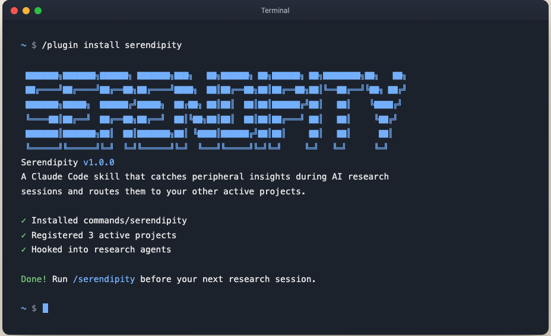

# Serendipity

**Stop throwing away 90% of what your research finds.**



[](https://opensource.org/licenses/MIT)
[](https://docs.claude.com/en/docs/claude-code)
[](#)

---

## Overview

When you ask Claude to research something, it reads dozens of sources and throws away ~90% of what it found to give you a focused answer.

The discarded pile is often full of things relevant to your **other** projects.

Serendipity catches them before they're lost.

## Why I built this

I noticed a habit. After long research sessions with Claude, I'd ask one extra question:

> "Did you find anything that might be useful for my other projects?"

The answer was surprisingly often yes — and the findings were usually specific and useful. Things that would never have made it into the research summary because they were technically "off-topic."

Usually I'd ignore it and move on. One weekend I didn't. I built this so the side discoveries stop getting lost.

## Core Concept

The system captures secondary discoveries that emerge during research — findings relevant to other active projects or general interests — rather than letting them disappear.

> Every time you run deep research with AI, the model traverses a massive information landscape, then filters everything down to a focused answer. Everything else it found? Silently discarded.

Serendipity intercepts that "everything else."

## Key Features

- **Minimal overhead** — ~1-5% extra tokens. Reuses research already done.
- **No infrastructure** — no embeddings, vector DBs, or background jobs.
- **Project-aware** — register your active projects once; routing is automatic.
- **Flexible storage** — Markdown, Obsidian, Claude Code memory, or custom paths.
- **You stay in control** — review and approve each insight before it saves.

## How It Works

The skill operates through prompt injection — instructing research agents to note findings relevant to your registered projects while answering the primary question. No embeddings, vector databases, or background processing required.

At the end of a session, Serendipity surfaces what it caught and lets you keep what matters and skip the rest.

## Getting Started

Install in Claude Code:

```
/plugin install serendipity
```

Register your active projects (one-time, ~30 seconds):

```
/serendipity setup
```

Activate before a research session:

```
/serendipity
```

That's it. Run research as you normally would. Review what it caught at the end.

## Storage Options

Captured insights can be saved to:
- Markdown files (default)
- Obsidian vaults
- Claude Code memory
- Custom locations you define during setup

## Contributing

Built on a weekend. Issues, PRs, and ideas for what else is worth capturing are all welcome.

## License

MIT
